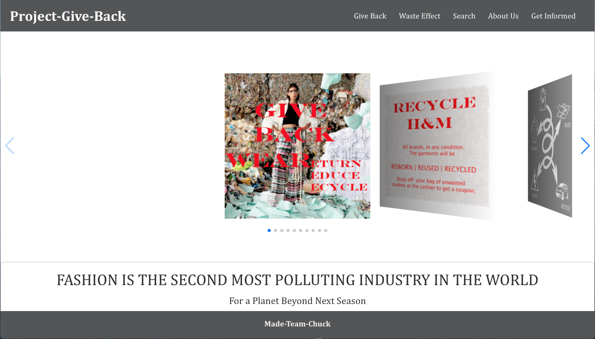
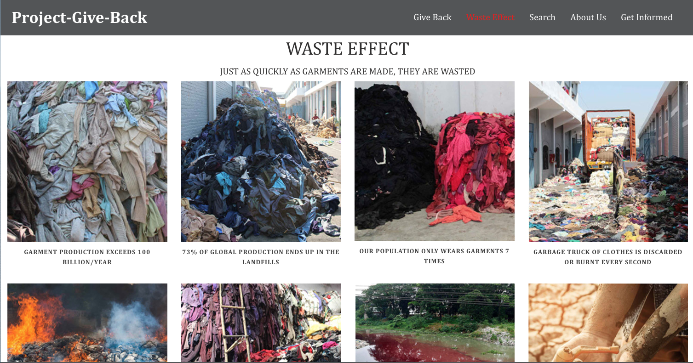
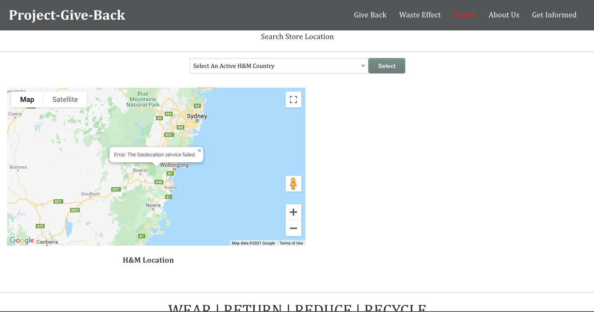
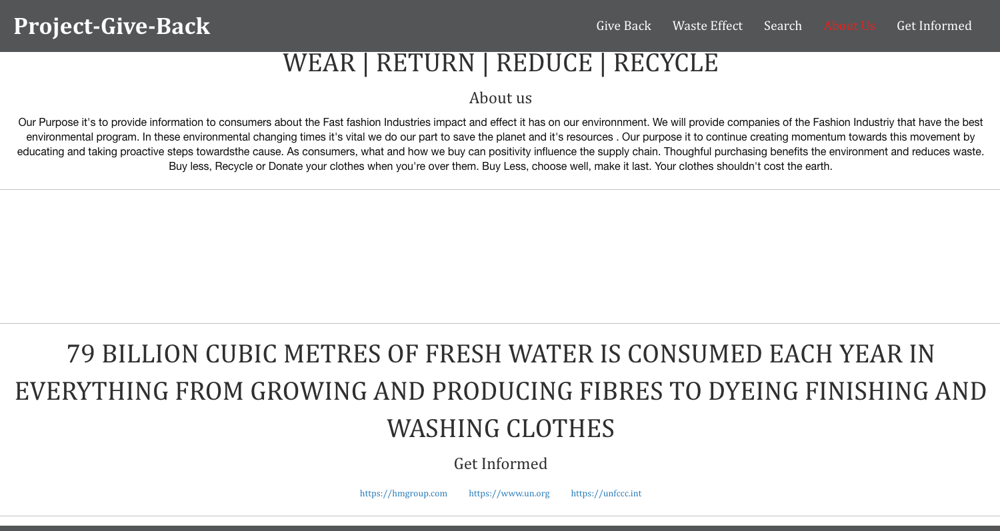
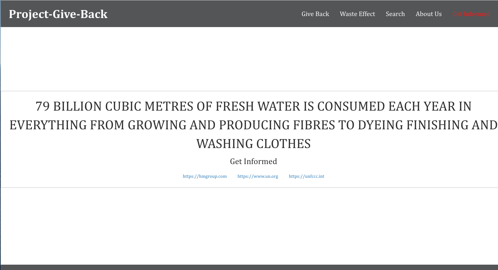

Title: Project-Give BACK 

Description:   
Our purpose of Project-Give-Back is to provide information to consumers about the fast fashion    
industries impact and effects it has on our environment.We will try to provide consumer with      
companies in fashion and especially the fast fashion companies that are trying to minimais    
they're damage.   

What's Fast Fashion?       
Fast Fashion is a term used by fashion retailers to describe inexpensive designers that move     
quickly from catwalk to stores to meet new trends. As a result of this trends, the tradition    
of indroctucing new fashion lines on a seasonal basis is being challenged.    

Installation:   
Front End Technoly use   
Wireframe -use Foundation   
Swiper for slider    
Adobe Photoshop   
Adobe Illustrator   
-Back End   
Google location.js      
HM JavaAjax.js   

Contributors:   
Wendy Figueroa -Front End   
Thokozile Soko -Back End   
Tom Rumero -Back End   

Screenshot 

    
   
    
    
    

Resources use on Front End:       

https://get.foundation/building-blocks/blocks/featured-image-block-grid.html

https://get.foundation/building-blocks/blocks/responsive-sticky-menu.html

https://get.foundation/sites/docs/grid.html

https://get.foundation/sites/docs/dropdown.html

https://get.foundation/sites/docs-v5/components/buttons.html

https://stackoverflow.com/questions/10732690/offsetting-an-html-anchor-to-adjust-for-fixed-header

https://tinyjpg.com

https://www.thebalancesmb.com/textile-recycling-facts-and-figures-2878122

https://harmony1.com/sweden-recycling-rate/

https://thelogicalindian.com/responsiblebusiness/hm-installs-in-store-recycling-machine-24247

https://www.youtube.com/watch?v=IscWfmbWWJc

https://www.youtube.com/watch?v=xGF3ObOBbac

https://www.youtube.com/watch?v=tLfNUD0-8ts

https://www.un.org/sustainabledevelopment/blog/2019/08/actnow-for-zero-waste-fashion/

https://www.vogue.com/article/fashion-pact-sustainability-g7-summit-emmanuel-macron

https://earth.org/sustainable-business-the-green-and-the-greenwash/

https://circulareconomy.europa.eu/platform/en/commitments/hm-groups-vision-become-100-circular

https://hmgroup.com/sustainability.html

